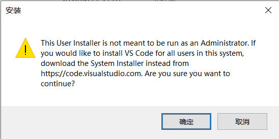
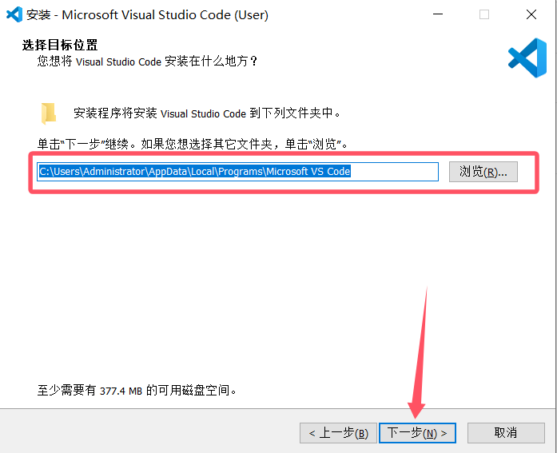
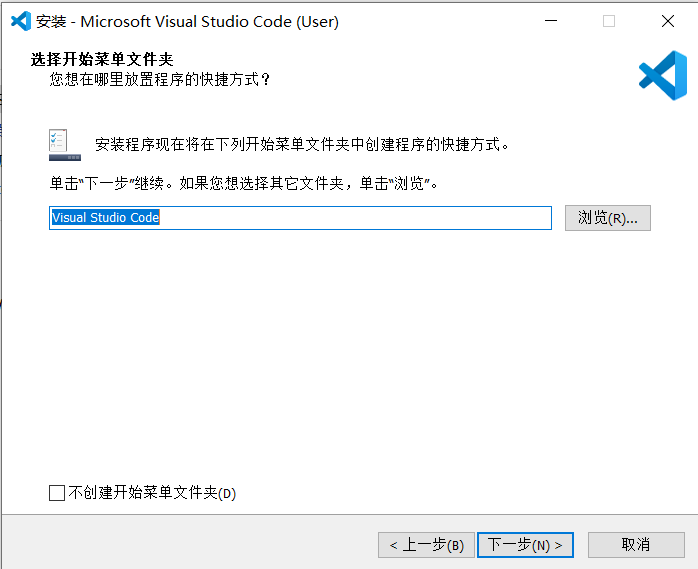
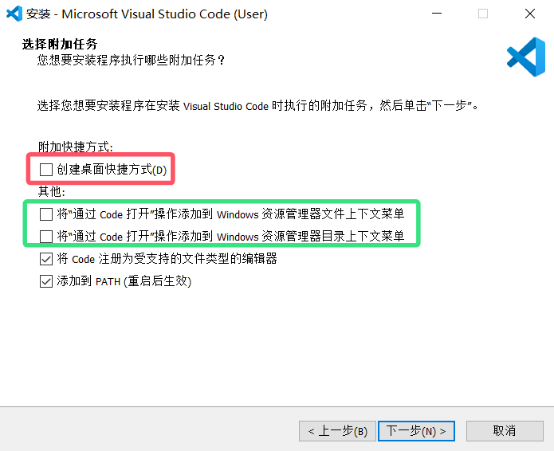

# 如何安装 Visual Studio Code

## 安装

1. 左键双击安装包 `VSCodeUserSetup.exe`
2. 如果出现如下图所示警告弹窗    
    
    请点击`确定`进行安装
3. 如果出现如下图所示安装窗口，请点击`我同意该协议`左侧的小圆圈，然后点击`下一步`  
    
4. 选择或填写一个你想要安装的位置，然后点击`下一步`  
    
5. 继续点击`下一步`  
    
6. 红色方框内的选项请勾选，绿色方框内的选项建议勾选，然后点击`下一步`  
    
7. 点击`安装`
    
8. 等待安装完成
9. 安装完成后，点击`完成`
    
