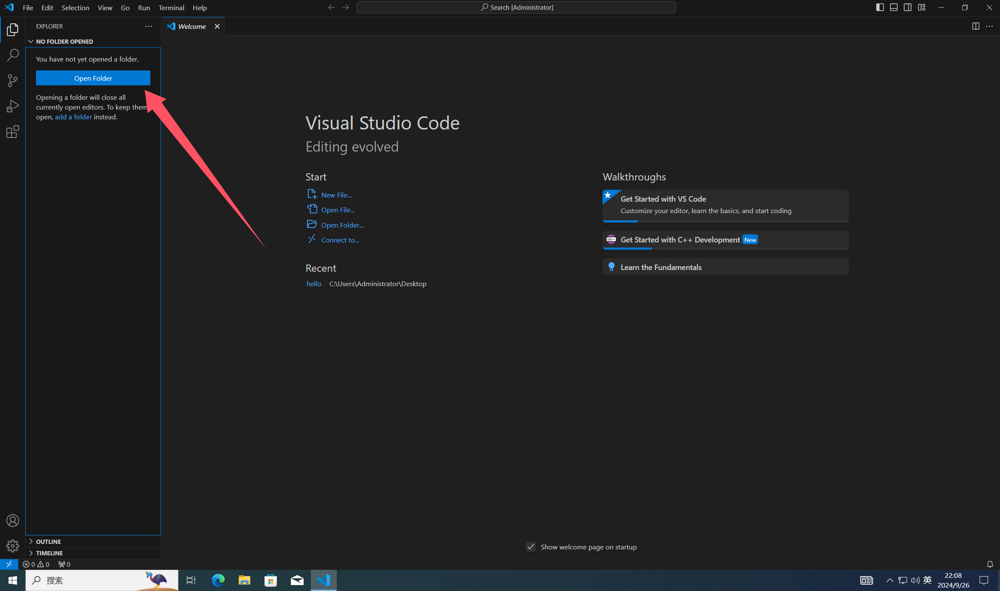

# Visual Studio Code 运行C/C++程序 (安装)教程

## 注意事项

* 以下简称
  * `Visual Studio Code` 为 `VSC`

* 注意
  * 在本教程中所有看到的蓝色字体都可进行点击跳转，请不要傻愣愣的看着屏幕！！！
  * 本教程建议在 `PC(电脑)端` 进行查看，手机端可能会操作不便！
  * 本教程仅供学习使用，不得用于商业用途！
  * 本教程仅比较完美的适配 `Windows系统用户` 使用！

## 目录

1. [下载](#下载教程)
2. [安装](#安装教程)
3. [配置](#配置教程)
4. [使用](#使用教程)

## 教程

### 下载教程

1. 下载必备的 `VSC`, `msvc`  
    [不懂如何下载？](./Download.MD)
2. 下载完毕后, 找到下载文件所在位置  
    [找不到文件位置？](./Download.MD/#文件位置)

### 安装教程

1. 解压缩 `msvc压缩包`
    [如何解压缩](./Unzip.MD)
2. 将msvc解压文件放到你想放的位置  
    [不知道放哪？](./Hopeless.MD)  
3. 安装 `Visual Studio Code`  
    [如何安装？](./Install.MD)

### 配置教程

1. 打开 `VSC`，如果刚安装好 `VSC` 则会自动打开
2. 点击左侧的 `扩展` 图标，如图  
    
3. 在搜索框中输入 `C/C++`，然后点击 `install` 安装，如图安装框示的插件
    
4. 最小化 `VSC` 窗口，
    
5. 找到你解压的 `msvc` 文件夹，如图  
    
6. 依次打开 `mingw32\bin` 文件夹，然后点击上方导航栏，复制当前路径，如图  
    
7. 在资源管理器中左侧找到 `此电脑`，右键点击，然后点击 `属性`，如图  
    
8. 点击 `高级系统设置`，如图
    
9. 点击 `环境变量`，如图
    
10. 在 `环境变量` 中找到 `Path`，然后点击 `编辑`，如图
    
11. 点击 `新建`，如图
    
12. 粘贴刚才复制的路径，然后点击 `确定`，如图
    
13. 点击 `确定`，如图
    
    

### 使用教程

1. 打开 `VSC`，然后点击 `打开文件夹`，选择一个文件夹作为目录，如图  
    
    

2. 现在你可以点击如图按钮创建文件并命名，如图  
    
    

3. 现在你就可以打开 `.c` 文件，然后点击右上角的小三角图标进行编译并运行啦，如图  
    
